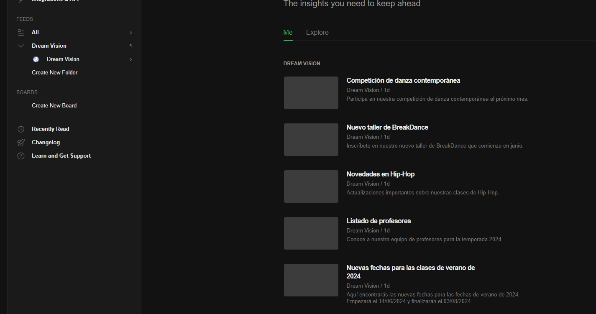

# Dance Academy

This is the README file for Dance Academy, a platform dedicated to providing high-quality dance education and training. Below you'll find detailed information about the main features of our platform, third-party components used, helpful tutorials, and more.

## Description

Dance Academy is an online platform aimed at dance enthusiasts of all levels. Whether you're a beginner looking to learn the basics or an experienced dancer wanting to refine your skills, Dance Academy has something for everyone. Our platform offers a wide range of dance styles, including ballet, hip-hop, salsa, contemporary, and more. With expert instructors, interactive lessons, and a supportive community, Dance Academy is your one-stop destination for dance education.

## Third-party Components

Dance Academy utilizes several third-party components to enhance the user experience:

- [React Player](https://www.npmjs.com/package/react-player) - A React component for playing a variety of media files.
- [React Bootstrap](https://react-bootstrap.github.io/) - Bootstrap components built with React.
- [Font Awesome](https://fontawesome.com/) - A library of scalable vector icons.

## Helpful Tutorials

The following tutorials were instrumental in the development of Dance Academy:

- [React Tutorial for Beginners](https://www.youtube.com/watch?v=Ke90Tje7VS0) - A comprehensive tutorial on getting started with React.
- [Creating a Responsive Navbar with Bootstrap](https://www.youtube.com/watch?v=HY4Dx3Ji3Fc) - Learn how to create a responsive navigation bar using Bootstrap.

## Features

- **Wide Range of Dance Styles:** Choose from a variety of dance styles, including ballet, hip-hop, salsa, contemporary, and more.
- **Expert Instructors:** Learn from experienced dance instructors who are passionate about teaching and helping you achieve your goals.
- **Interactive Lessons:** Engage in interactive lessons that cater to different learning styles and skill levels.
- **Community Support:** Connect with fellow dancers, share experiences, and receive support from the Dance Academy community.
- **Personalized Progress Tracking:** Track your progress and set goals with our personalized progress tracking feature.

## Contributing

We welcome contributions from the community to improve Dance Academy. If you'd like to contribute, please fork the repository, make your changes, and submit a pull request. For major changes, please open an issue first to discuss the proposed changes.

## License

Dance Academy is licensed under the MIT License. See the [LICENSE](LICENSE) file for details.

## Link for my page with hosting

This is the link for my Dance Academy page (https://danceacademy-d905d.web.app).

## RSS screenshot

---
This README template is inspired by [Best-README-Template](https://github.com/othneildrew/Best-README-Template).

